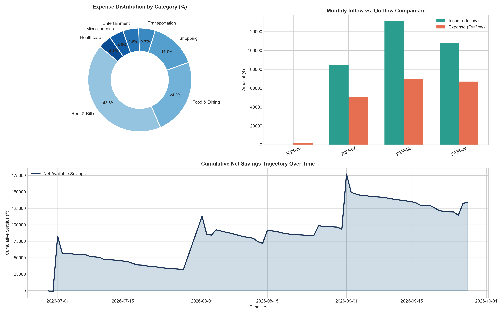

# 💰 Personal Expense Tracker & Financial Analytics Engine

A robust personal finance and expense analytics engine built with **Python**, **Pandas**, **NumPy**, and **Matplotlib**. It tracks income and expenses, generates executive financial KPI summaries, and renders high-resolution multi-panel visual dashboards.

---

## 📸 Dashboard Preview

The engine automatically generates a 3-panel visual dashboard summarizing your financial health:



---

## ✨ Features

- **📊 Comprehensive Visual Dashboard**:
  - **Category Breakdown (Donut Chart)**: Percentage distribution of expenses across spending categories.
  - **Monthly Inflow vs. Outflow (Grouped Bar Chart)**: Side-by-side comparison of monthly income and expenses.
  - **Cumulative Net Savings Trajectory (Area Chart)**: Long-term savings growth and cash flow timeline.
- **📈 Executive Financial KPI Reporting**:
  - Computes Total Inflow, Total Outflow, Net Savings, and Savings Rate (%).
  - Detailed expense category breakdown with total spending, transaction volume, and percentage share.
- **📝 Transaction Management**:
  - Add income and expenses with validated categories, normalized dates, auto-incrementing IDs, and descriptions.
  - Auto-initializes local CSV storage if not already present.
- **🎲 Synthetic Data Generator**:
  - Built-in Monte Carlo / Poisson-distributed generator to simulate realistic spending habits, recurring salaries, utility bills, and freelance gigs for immediate analysis.

---

## 📁 Repository Structure

```text
Expense_Tracker/
├── expense_tracker.py              # Core tracker engine, analytics, and visualization logic
├── personal_expenses.csv           # Persistent CSV storage for transactions
├── personal_financial_dashboard.png# High-resolution generated dashboard
├── requirements.txt                # Python package dependencies
└── README.md                       # Project documentation
```

---

## 🗃️ Data Schema

Transactions are stored in `personal_expenses.csv` with the following schema:

| Column | Type | Description |
|---|---|---|
| `transaction_id` | Integer | Unique identifier for each transaction (starts at 1001) |
| `date` | String (`YYYY-MM-DD`) | Date of transaction |
| `type` | String | `Income` or `Expense` |
| `category` | String | Pre-defined category (e.g., `Salary`, `Food & Dining`, `Rent & Bills`) |
| `amount` | Float | Transaction amount (rounded to 2 decimal places) |
| `description` | String | Note or memo for the transaction |

### Supported Categories

- **Expense Categories**: `Food & Dining`, `Rent & Bills`, `Transportation`, `Entertainment`, `Healthcare`, `Shopping`, `Miscellaneous`
- **Income Categories**: `Salary`, `Freelance`, `Investments`, `Bonus`, `Other Income`

---

## 🚀 Getting Started

### Prerequisites

- Python 3.8+
- Required packages: `pandas`, `numpy`, `matplotlib`

### Installation

1. Clone the repository:
   ```bash
   git clone https://github.com/manjumuraliotp/Expense_Tracker.git
   cd Expense_Tracker
   ```

2. Install dependencies:
   ```bash
   pip install -r requirements.txt
   ```

---

## 💻 Usage

### 1. Run the Complete Workflow
Run the script directly to populate sample data, log transactions, print the financial summary, and render the dashboard:
```bash
python expense_tracker.py
```

### 2. Programmatic Usage in Python
You can import and use `PersonalExpenseTracker` in your own scripts:

```python
from expense_tracker import PersonalExpenseTracker

# Initialize tracker (creates personal_expenses.csv if not present)
tracker = PersonalExpenseTracker("personal_expenses.csv")

# Add income
tracker.add_transaction(
    trans_type="Income",
    category="Salary",
    amount=85000.0,
    description="Monthly Corporate Salary"
)

# Add an expense
tracker.add_transaction(
    trans_type="Expense",
    category="Food & Dining",
    amount=1250.0,
    description="Weekend Dinner"
)

# Print executive financial report to console
tracker.generate_summary()

# Generate and save visual dashboard
tracker.visualize_dashboard("personal_financial_dashboard.png")
```

---

## 📊 Sample Terminal Output

```text
=======================================================
          EXECUTIVE FINANCIAL HEALTH REPORT          
=======================================================
 Total Inflow (Income)    : ₹2,59,500.00
 Total Outflow (Expenses) : ₹1,62,420.50
 Net Savings              : ₹97,079.50
 Savings Rate             : 37.4%
-------------------------------------------------------
Top Expense Categories by Volume:
                 Total_Spent  Share_%  Transaction_Count
category                                                
Rent & Bills        78000.00     48.0                  3
Food & Dining       35420.25     21.8                 42
Transportation      18250.00     11.2                 38
Shopping            16500.50     10.2                  8
Entertainment        9450.75      5.8                  9
Healthcare           3200.00      2.0                  2
Miscellaneous        1599.00      1.0                  3
=======================================================
```

---

## 📄 License

This project is licensed under the MIT License - feel free to use and adapt it for personal or educational purposes.
